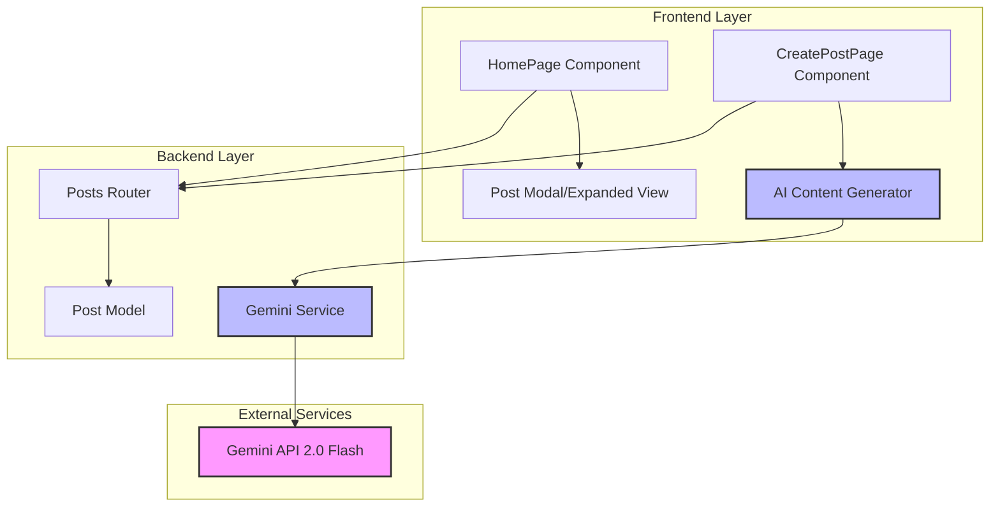
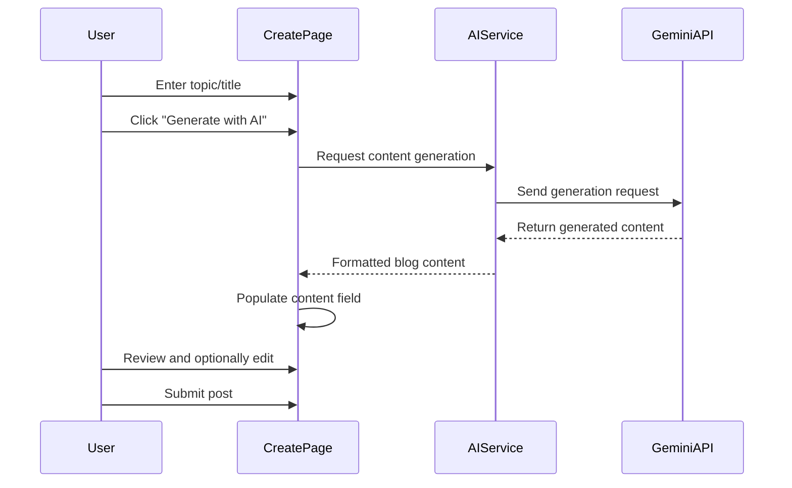
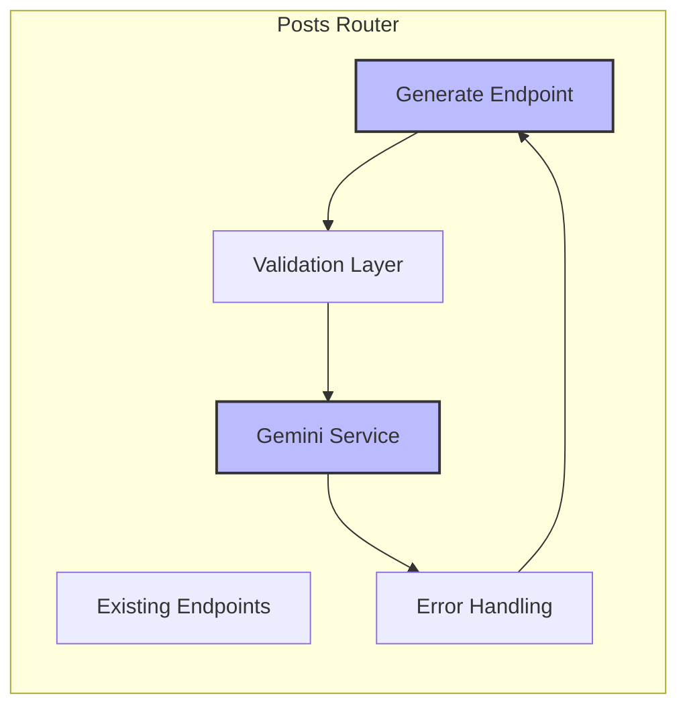
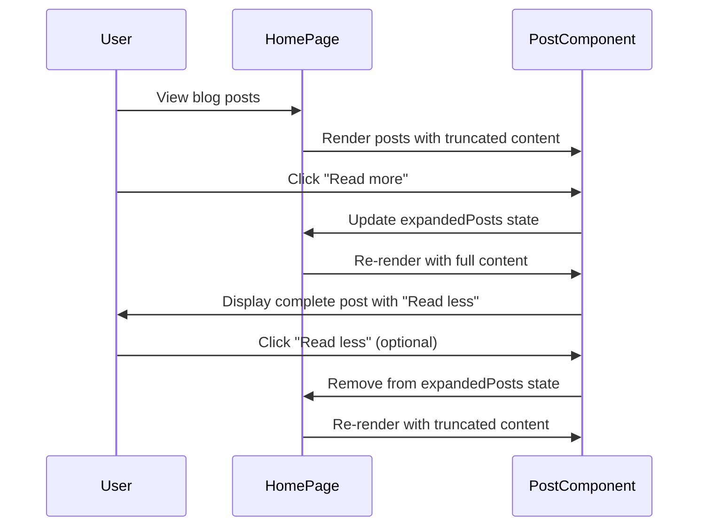
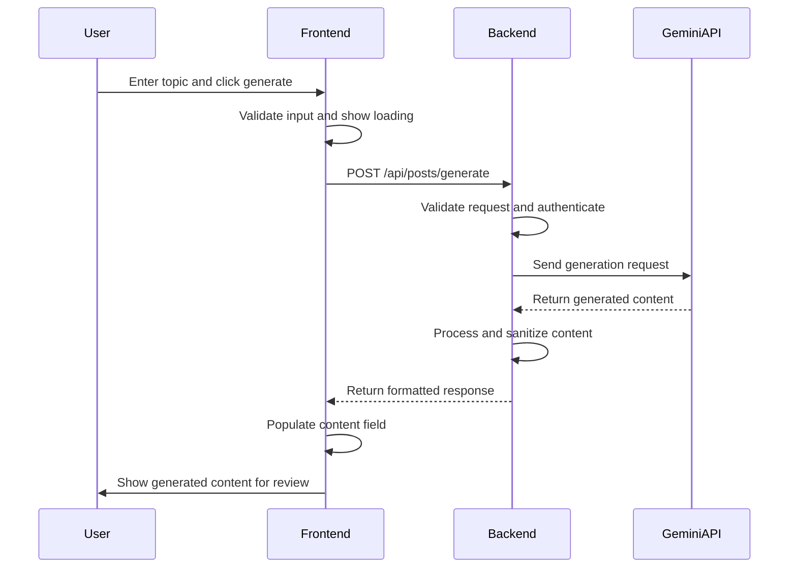

# Blog Read More Fix and Gemini AI Integration Design

## Overview

This design document outlines the enhancement of the existing blog application to fix the non-functional "Read more" button on the home page and integrate Google's Gemini 2.0 Flash API for automatic blog content generation. The solution will enable users to view complete blog posts and generate AI-powered content from topic titles.

## Architecture

The enhancement involves modifications to both frontend and backend components to support expandable post views and AI content generation capabilities.



## Frontend Architecture

### Component Enhancements

#### HomePage Component Modifications

The current HomePage component displays truncated blog posts with a non-functional "Read more" button. The enhancement will implement post expansion functionality.

**Current Issue Analysis:**

- Read more button exists but lacks click handler
- No state management for expanded posts
- Missing UI mechanism to show/hide full content

**Enhanced Component Structure:**

| Component State | Type        | Purpose                        |
| --------------- | ----------- | ------------------------------ |
| expandedPosts   | Set<string> | Track which posts are expanded |
| posts           | Array       | Current post data              |
| loading         | boolean     | Loading state management       |
| pagination      | Object      | Pagination information         |

**Post Display Logic:**

| Content Length | Display Behavior           | Action Button      |
| -------------- | -------------------------- | ------------------ |
| ≤ 300 chars    | Show full content          | None               |
| > 300 chars    | Show truncated (300 chars) | "Read more" button |
| Expanded state | Show full content          | "Read less" button |

#### CreatePostPage Component Enhancements

The component will be enhanced with AI content generation capabilities.

**AI Integration Features:**

| Feature         | Description                              | UI Element                |
| --------------- | ---------------------------------------- | ------------------------- |
| Topic Input     | Field for entering blog topic/title      | Text input field          |
| AI Generation   | Button to trigger content generation     | "Generate with AI" button |
| Content Preview | Display generated content before posting | Preview section           |
| Manual Override | Allow editing of AI-generated content    | Editable textarea         |

**Component Flow:**



### State Management Strategy

#### Post Expansion State

The HomePage will manage post expansion using local component state rather than global state management for simplicity and performance.

**Expansion State Structure:**

```
expandedPosts: Set<postId>
- Add postId when "Read more" clicked
- Remove postId when "Read less" clicked
- Check membership for display logic
```

#### AI Generation State

The CreatePostPage will manage AI generation states including loading, error handling, and content management.

**AI State Structure:**

| State Variable   | Type    | Purpose                           |
| ---------------- | ------- | --------------------------------- |
| isGenerating     | boolean | Show loading during AI generation |
| generatedContent | string  | Store AI-generated content        |
| generationError  | string  | Handle API errors                 |
| topicInput       | string  | User-provided topic/title         |

## Backend Architecture

### Gemini API Integration Service

A dedicated service will handle communication with Google's Gemini 2.0 Flash API for content generation.

**Service Responsibilities:**

- API authentication management
- Request formatting and validation
- Response processing and error handling
- Content sanitization and formatting

**API Integration Specifications:**

| Configuration  | Value                                            | Purpose                  |
| -------------- | ------------------------------------------------ | ------------------------ |
| Base URL       | https://generativelanguage.googleapis.com/v1beta | Gemini API endpoint      |
| Model          | gemini-2.0-flash:generateContent                 | Content generation model |
| Authentication | X-goog-api-key header                            | API key authentication   |
| Content Type   | application/json                                 | Request format           |

**Request Structure Template:**

```
{
  "contents": [
    {
      "parts": [
        {
          "text": "Write a comprehensive blog post about [TOPIC]. Include an engaging introduction, detailed main content with multiple sections, and a compelling conclusion. The post should be informative, well-structured, and approximately 800-1200 words."
        }
      ]
    }
  ]
}
```

### API Endpoint Design

#### New Endpoint: Content Generation

A new protected endpoint will handle AI content generation requests.

**Endpoint Specification:**

| Method | Path                | Authentication | Purpose                          |
| ------ | ------------------- | -------------- | -------------------------------- |
| POST   | /api/posts/generate | Required (JWT) | Generate blog content from topic |

**Request/Response Schema:**

| Request Field | Type   | Validation                         | Required                   |
| ------------- | ------ | ---------------------------------- | -------------------------- |
| topic         | string | 5-200 characters, no special chars | Yes                        |
| tone          | string | casual/formal/professional         | No (default: professional) |
| length        | string | short/medium/long                  | No (default: medium)       |

| Response Field | Type    | Description               |
| -------------- | ------- | ------------------------- |
| success        | boolean | Generation success status |
| content        | string  | Generated blog content    |
| title          | string  | Suggested blog title      |
| error          | string  | Error message if failed   |

### Enhanced Posts Router

The existing posts router will be extended with the content generation endpoint while maintaining current functionality.

**Router Enhancement Structure:**



## Data Flow Architecture

### Read More Functionality Flow



### AI Content Generation Flow



## Business Logic Layer

### Content Expansion Logic

The post expansion functionality will follow a simple toggle pattern with visual feedback.

**Expansion Rules:**

- Posts with content ≤ 300 characters: No truncation needed
- Posts with content > 300 characters: Show first 300 characters + "..."
- Expansion state persists during pagination
- Multiple posts can be expanded simultaneously

**Visual Feedback Specifications:**

| State     | Button Text   | Button Color | Animation        |
| --------- | ------------- | ------------ | ---------------- |
| Collapsed | "Read more →" | Indigo-600   | Fade-in content  |
| Expanded  | "Read less ↑" | Indigo-600   | Fade-out content |
| Loading   | "Loading..."  | Gray-400     | Spinner icon     |

### AI Content Generation Logic

The content generation service will create structured, high-quality blog content based on user-provided topics.

**Generation Parameters:**

| Parameter | Options                                            | Default      | Impact               |
| --------- | -------------------------------------------------- | ------------ | -------------------- |
| Length    | short (300-500), medium (500-800), long (800-1200) | medium       | Word count target    |
| Tone      | casual, professional, academic                     | professional | Writing style        |
| Structure | intro-body-conclusion                              | enabled      | Content organization |

**Content Quality Assurance:**

- Minimum content length validation (200 words)
- Inappropriate content filtering
- Duplicate content detection
- Grammar and readability optimization

**Error Handling Strategy:**

| Error Type     | Response                               | User Action            |
| -------------- | -------------------------------------- | ---------------------- |
| API Rate Limit | "Please try again in a few minutes"    | Retry after delay      |
| Invalid Topic  | "Please provide a more specific topic" | Revise input           |
| Network Error  | "Check your connection and try again"  | Retry request          |
| Content Policy | "Topic violates content guidelines"    | Choose different topic |

## API Integration Layer

### Gemini API Service Implementation

The service will abstract Gemini API complexity and provide a clean interface for content generation.

**Service Interface Design:**

| Method          | Parameters     | Returns                | Purpose                |
| --------------- | -------------- | ---------------------- | ---------------------- |
| generateContent | topic, options | Promise<ContentResult> | Main generation method |
| validateTopic   | topic          | boolean                | Input validation       |
| formatPrompt    | topic, options | string                 | Prompt construction    |
| parseResponse   | apiResponse    | ContentResult          | Response processing    |

**Configuration Management:**

| Configuration Item | Storage              | Access Pattern          |
| ------------------ | -------------------- | ----------------------- |
| API Key            | Environment variable | Secure server-side only |
| Rate Limits        | In-memory cache      | Request throttling      |
| Default Prompts    | Configuration file   | Template loading        |

### Request Optimization

**Caching Strategy:**

- Cache frequently requested topics for 24 hours
- Implement request deduplication for concurrent requests
- Rate limiting per user (5 requests per hour)

**Performance Considerations:**

| Aspect         | Strategy                              | Benefit              |
| -------------- | ------------------------------------- | -------------------- |
| Response Time  | Async processing with loading states  | Better UX            |
| Memory Usage   | Stream processing for large responses | Reduced server load  |
| Error Recovery | Exponential backoff with retries      | Improved reliability |

## Testing Strategy

### Frontend Testing

**Component Testing Requirements:**

| Component      | Test Cases                                        | Coverage Target |
| -------------- | ------------------------------------------------- | --------------- |
| HomePage       | Post expansion/collapse, pagination, error states | 90%             |
| CreatePostPage | AI generation, form validation, content editing   | 90%             |
| AI Components  | Loading states, error handling, content display   | 85%             |

**Integration Testing:**

- End-to-end post expansion workflow
- Complete AI generation and posting flow
- Error scenario handling across components

### Backend Testing

**API Testing Requirements:**

| Endpoint                 | Test Scenarios                                      | Validation              |
| ------------------------ | --------------------------------------------------- | ----------------------- |
| POST /api/posts/generate | Valid/invalid topics, authentication, rate limiting | Request/response format |
| Existing endpoints       | Regression testing for unchanged functionality      | No breaking changes     |

**Service Testing:**

- Gemini API integration with mock responses
- Error handling for various API failure modes
- Content sanitization and validation

## Security Considerations

### API Key Management

**Security Measures:**

- Store Gemini API key in environment variables only
- Implement server-side proxy to hide API key from frontend
- Regular key rotation schedule (monthly)
- API key access logging and monitoring

### Content Security

**Input Validation:**

- Topic input sanitization to prevent injection attacks
- Content length limits to prevent abuse
- Rate limiting per user to prevent API quota exhaustion
- Generated content review for inappropriate material

**Privacy Protection:**

| Data Type         | Storage               | Retention       | Access            |
| ----------------- | --------------------- | --------------- | ----------------- |
| User Topics       | Not stored            | N/A             | User session only |
| Generated Content | User's choice to save | User-controlled | Owner only        |
| API Logs          | Server logs only      | 30 days         | Admin access only |

### Authentication and Authorization

**Access Control:**

- AI generation requires user authentication
- Rate limiting tied to authenticated user accounts
- API endpoint protection with existing JWT middleware
- Admin controls for service enable/disable
