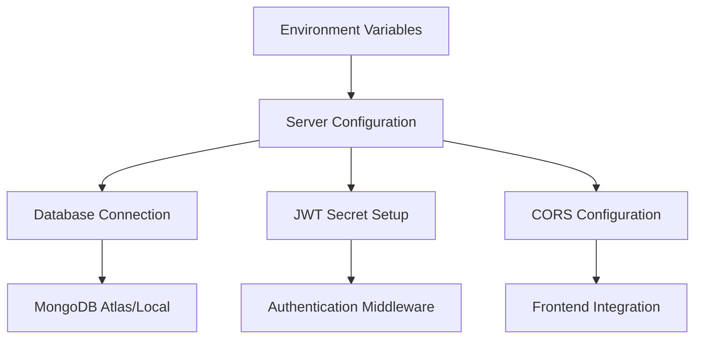
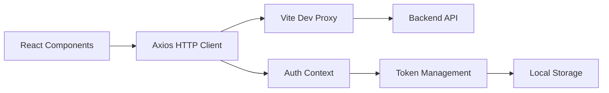
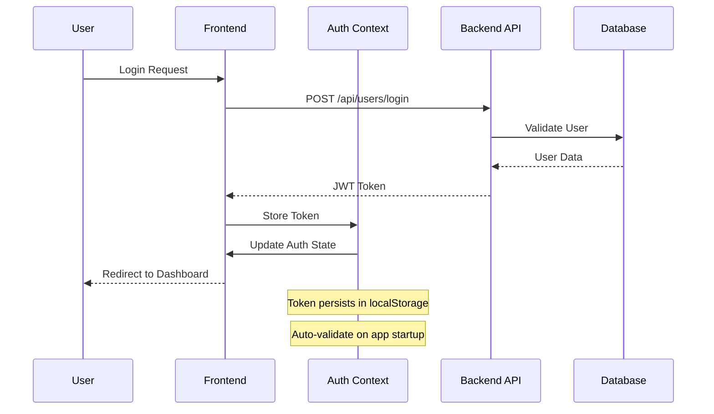
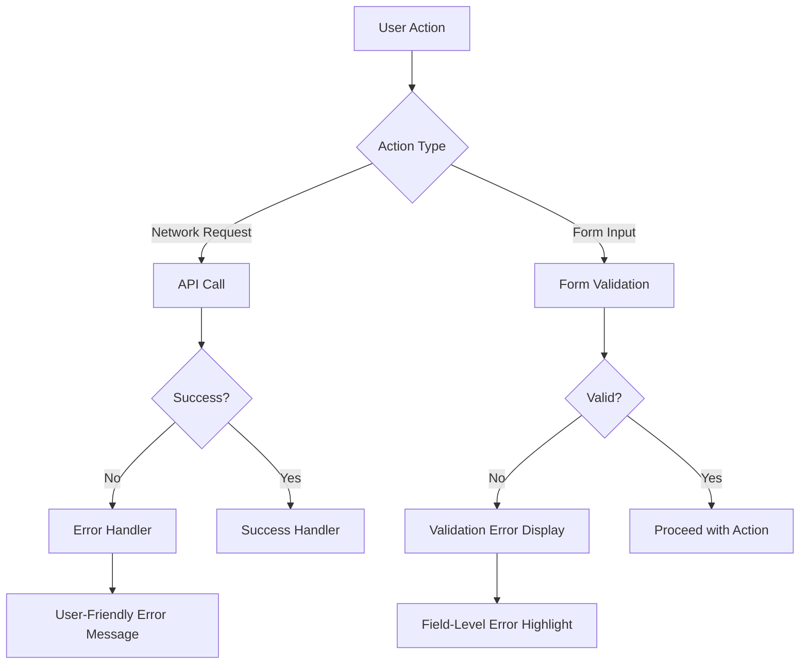

# Blog Application Issue Resolution & Enhancement Design

## Overview

This design document addresses critical issues identified in the full-stack MERN Blog application and provides structured solutions to ensure proper functionality, security, and user experience. The application consists of an Express.js backend with MongoDB and a React frontend with Vite build system.

## Repository Analysis

**Repository Type**: Full-Stack MERN Application

- **Backend**: Express.js with MongoDB/Mongoose
- **Frontend**: React with Vite, TailwindCSS
- **Authentication**: JWT-based system
- **State Management**: React Context API

## Critical Issues Identified

### 1. Environment Configuration Issues

**Problem**: Missing environment configuration files and variables

- No `.env` file found in backend directory
- JWT_SECRET and MONGO_URI are undefined
- Database connection will fail without proper MongoDB URI

**Impact**: Application cannot start, authentication fails, database connection errors

### 2. Frontend API Base URL Configuration

**Problem**: Inconsistent API endpoint configuration

- Commented out axios base URL in main.jsx
- Relying solely on Vite proxy configuration
- Potential production deployment issues

**Impact**: API calls may fail in production environments

### 3. Authentication Context Integration Gap

**Problem**: Authentication context not properly integrated with main application

- AuthProvider wraps App but context may not persist across page refreshes
- Token validation on application startup missing

**Impact**: Users may lose authentication state on page refresh

### 4. Missing Input Validation & Error Handling

**Problem**: Limited frontend input validation and error handling

- No form validation beyond HTML5 required attributes
- Insufficient error messaging for edge cases
- Missing loading states for better UX

**Impact**: Poor user experience, potential security vulnerabilities

### 5. Missing Registration Page Implementation

**Problem**: RegisterPage component referenced but not examined

- Registration functionality may be incomplete
- Consistent styling and error handling needed

**Impact**: Users cannot create new accounts

## Architecture Enhancement Design

### Backend Configuration Layer

**Environment Configuration Requirements**:

| Variable   | Purpose                    | Example Value                  |
| ---------- | -------------------------- | ------------------------------ |
| MONGO_URI  | Database connection string | mongodb://localhost:27017/blog |
| JWT_SECRET | Token signing secret       | complex-random-string-32-chars |
| PORT       | Server port                | 5000                           |
| NODE_ENV   | Environment mode           | development/production         |

### Frontend API Integration Architecture

**API Configuration Strategy**:

- Development: Use Vite proxy for local development
- Production: Configure absolute API URLs
- Token Management: Centralized through AuthContext
- Error Handling: Consistent error boundary implementation

### Authentication Flow Enhancement

**Authentication Requirements**:

- Token persistence across browser sessions
- Automatic token validation on application startup
- Graceful handling of expired tokens
- Secure token storage practices

### Data Validation & Error Handling Layer

**Frontend Validation Strategy**:

| Component      | Validation Rules                     | Error Handling                  |
| -------------- | ------------------------------------ | ------------------------------- |
| LoginPage      | Username: required, min 3 chars      | Field-level + form-level errors |
| RegisterPage   | Password: min 6 chars, confirm match | Real-time validation feedback   |
| CreatePostPage | Title: required, max 200 chars       | Content length validation       |
| All Forms      | Network error handling               | Retry mechanisms                |

**Backend Validation Enhancement**:

| Endpoint                 | Validation Rules                       | Response Format             |
| ------------------------ | -------------------------------------- | --------------------------- |
| POST /api/users/register | Username uniqueness, password strength | Standardized error messages |
| POST /api/users/login    | Rate limiting, input sanitization      | Consistent error codes      |
| POST /api/posts          | Content validation, auth verification  | Detailed validation errors  |

### Database Schema Optimization

**User Model Enhancement**:

- Add email field for better user identification
- Implement password strength requirements
- Add user profile fields (optional)
- Created/updated timestamps already implemented

**Post Model Enhancement**:

- Add content length validation
- Implement post categories/tags
- Add post status (draft/published)
- Enhanced author relationship handling

### Security Implementation Strategy

**Backend Security Measures**:

- Input sanitization for all user inputs
- Rate limiting for authentication endpoints
- CORS configuration for production
- Environment variable validation

**Frontend Security Measures**:

- XSS prevention through proper data handling
- Secure token storage considerations
- Input validation and sanitization
- Secure route protection

### Error Handling & User Experience

**Error Handling Hierarchy**:

**Error Message Standards**:

- Clear, actionable error messages
- Consistent error styling across components
- Progressive error disclosure
- Recovery action suggestions

### Performance & Optimization Strategy

**Frontend Optimization**:

- Lazy loading for route components
- Memoization for expensive computations
- Debounced search functionality
- Optimized re-renders in context

**Backend Optimization**:

- Database query optimization
- Response compression
- Caching strategy for frequently accessed data
- Connection pooling for database

### Testing Strategy

**Unit Testing Requirements**:

| Component Type   | Testing Focus                | Tools                       |
| ---------------- | ---------------------------- | --------------------------- |
| React Components | Rendering, user interactions | Jest, React Testing Library |
| API Endpoints    | Request/response, validation | Jest, Supertest             |
| Authentication   | Token generation, validation | Jest                        |
| Database Models  | Schema validation, queries   | Jest, MongoDB Memory Server |

## Implementation Priority

### Phase 1: Critical Fixes (High Priority)

1. Create environment configuration files
2. Fix authentication context integration
3. Implement missing RegisterPage
4. Configure API base URLs properly

### Phase 2: Enhancement (Medium Priority)

1. Add comprehensive input validation
2. Implement error handling improvements
3. Enhance security measures
4. Add loading states and UX improvements

### Phase 3: Optimization (Low Priority)

1. Performance optimizations
2. Advanced error handling
3. Testing implementation
4. Documentation updates

## Configuration Requirements

### Backend Environment Setup

Required environment variables must be created in backend/.env file with appropriate values for database connection and JWT secret configuration.

### Frontend Build Configuration

Vite configuration needs environment-specific API URL handling to ensure proper functionality in both development and production environments.

### Database Configuration

MongoDB connection string must be properly configured with appropriate database name and connection parameters.

## Security Considerations

### Authentication Security

- JWT secret must be cryptographically secure
- Token expiration policies should be implemented
- Rate limiting on authentication endpoints

### Data Validation

- All user inputs must be validated and sanitized
- SQL injection prevention through parameterized queries
- XSS prevention through proper output encoding

### CORS Configuration

- Proper CORS headers for production deployment
- Restricted origins for security
- Secure cookie handling if implemented
